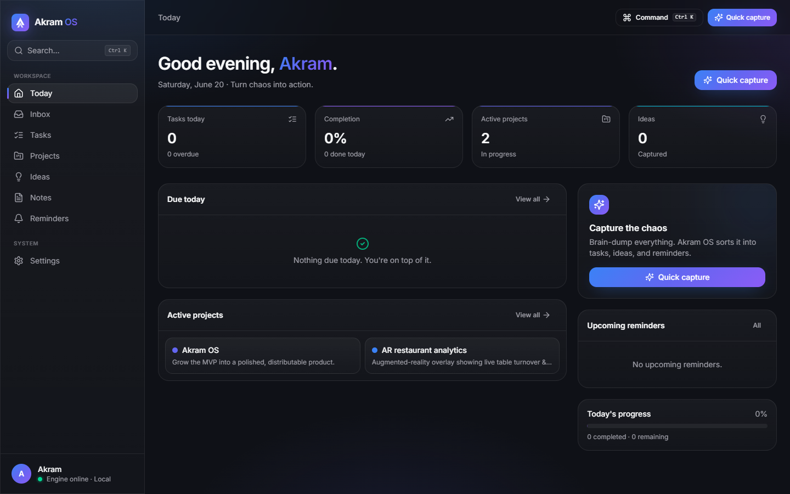

# CairnOS

> **Turn chaos into action.**
> A local-first AI productivity desktop app that turns messy brain dumps into organized
> projects, tasks, notes, ideas, and reminders.



CairnOS is **private by default** - your data lives in a single SQLite file on your machine.
A built-in rule-based engine classifies natural-language brain dumps into structured items, and
a local **MCP server** lets Claude Code read and modify the very same data the app uses.

---

## Why it's built this way

Tauri's UI runs in a webview and can't open a native SQLite file directly, and the MCP server is
a separate Node process that must share that same database. So a small **local engine**
(`apps/server`, Hono) owns the SQLite file and exposes a typed API. The result:

```
                          ┌────────────────────────┐
   Desktop UI (React) ───▶│  @cairn/server (Hono)  │
   TanStack Query / SSE   │     local engine       │──┐
                          └────────────────────────┘  │   ┌──────────────┐
                                                       ├──▶│  cairn.db    │  (SQLite + WAL)
   Claude Code ──stdio──▶ @cairn/mcp-server ───────────┘   └──────────────┘
                          (same @cairn/core + DB)
```

- **One brain, one database.** `@cairn/core` holds every service; both the engine and the MCP
  server call it, so the app and Claude always agree.
- **Runs in your browser today** (`pnpm dev`) with real SQLite persistence - no Rust required.
- **Tauri** wraps it into a native window when you want to ship a desktop binary.

## Tech stack

Tauri v2 · React 18 · TypeScript (strict) · Vite 6 · Tailwind CSS v4 · shadcn-style UI ·
SQLite + Drizzle ORM · Hono · TanStack Query · Zustand · Zod · date-fns · Framer Motion ·
lucide-react · Model Context Protocol SDK · Vitest.

## Monorepo layout

```
cairn/
├─ apps/
│  ├─ desktop/      # React + Vite UI (+ src-tauri native shell)
│  ├─ server/       # @cairn/server - local Hono engine that owns the DB
│  └─ mcp-server/   # @cairn/mcp-server - local MCP server (13 tools)
├─ packages/
│  ├─ shared/       # enums, domain types, Zod validators
│  ├─ db/           # Drizzle schema, migrations, client, seed
│  └─ core/         # services + the rule-based classifier
├─ docs/            # product-spec, architecture, database, design-system, mcp-setup
└─ .mcp.json        # ready-to-use Claude Code MCP config
```

## Quickstart

**Prerequisites:** Node 20+ and pnpm 10+. (Rust is only needed for the native Tauri build.)

```bash
pnpm install          # install the workspace
pnpm db:migrate       # create the local SQLite schema
pnpm db:seed          # optional: realistic sample data
pnpm dev              # start the engine + the web UI
```

Then open **http://localhost:5173**. The marketing page is at
**http://localhost:5173/#/landing**.

> The database is created at `%APPDATA%\Cairn\cairn.db` on Windows
> (`~/Library/Application Support/CairnOS` on macOS, `~/.local/share/CairnOS` on Linux).
> Override with `CAIRN_DB_PATH` or `CAIRN_DATA_DIR`.

## Commands

| Command | What it does |
| --- | --- |
| `pnpm dev` | Run the local engine **and** the web UI together. |
| `pnpm server:dev` | Run only the engine (port 4319). |
| `pnpm web:dev` | Run only the Vite UI (port 5173). |
| `pnpm desktop:dev` | Run the native Tauri app *(requires Rust)*. |
| `pnpm desktop:build` | Build a native desktop binary *(requires Rust)*. |
| `pnpm mcp:dev` | Run the local MCP server (stdio). |
| `pnpm db:generate` | Generate a Drizzle migration from the schema. |
| `pnpm db:migrate` | Apply pending migrations. |
| `pnpm db:seed` | Seed sample data (`CAIRN_SEED_FORCE=1` to reseed). |
| `pnpm typecheck` | Typecheck every package. |
| `pnpm build` | Production build of the web UI. |
| `pnpm --filter @cairn/core test` | Run the classifier unit tests. |

## The brain dump

Type something messy into Quick Capture (⌘/Ctrl + K → Quick capture):

> *tomorrow finish the launch deck, fix the signup bug, idea for referral rewards, remind me to
> email the team, prepare the Monday demo*

CairnOS extracts five reviewable items - a task due tomorrow, another task, an idea, a
reminder, and a task - each with a detected priority, due date, project suggestion, and a
confidence score, before you save. The classifier lives in `packages/core/src/classifier` and is
modular: swap it for a local Ollama model or the Claude API behind the same `classifyBrainDump`
signature.

## Connect Claude Code (MCP)

Register the server once at **user scope** so it's available in every Claude Code session, from
any folder:

```bash
claude mcp add cairn --scope user -- pnpm -C D:/Akram_OS --filter @cairn/mcp-server start
claude mcp list            # → cairn ✔ Connected
```

Now ask Claude *"what are my overdue tasks?"* or *"create a task to email the team
tomorrow at 9am."* Full guide (incl. project-scope `.mcp.json` for sharing the repo, and Claude
Desktop config): [`docs/mcp-setup.md`](docs/mcp-setup.md).

## Native desktop (Tauri)

The native shell lives in `apps/desktop/src-tauri` and is wired up with app icons and the
notification plugin. It needs the [Rust toolchain](https://www.rust-lang.org/tools/install) and
the platform WebView (WebView2 on Windows, already standard on Win 11). Then:

```bash
pnpm desktop:dev      # opens the native CairnOS window
```

`desktop:dev` auto-starts the engine + UI for you (via Tauri's `beforeDevCommand`), so you don't
need a separate `pnpm dev`.

### Standalone installer

```bash
pnpm desktop:build
```

This produces a **fully self-contained installer** - no Node, no repo required to run it:

- `…/target/release/bundle/nsis/CairnOS_0.1.0_x64-setup.exe` (~27 MB)
- `…/target/release/bundle/msi/CairnOS_0.1.0_x64_en-US.msi` (~40 MB)

The build bundles the engine as a sidecar: a matching `node.exe`, the esbuild-bundled engine,
the `better-sqlite3` native addon, and the migrations are shipped as Tauri resources
(`scripts/build-engine.mjs`). On launch the Rust app spawns the engine (self-migrating, on
`localhost:4319`) and shuts it down when the window closes. Data still lives in
`%APPDATA%\Cairn\cairn.db`, so the MCP server and the installed app share it.

## Optional power-ups

All off by default - the app is fully functional without them.

**Local AI classifier (Ollama).** Point the brain dump at a local model instead of the rule
engine. Install [Ollama](https://ollama.com), pull a model, then:

```bash
# PowerShell
$env:CAIRN_CLASSIFIER="ollama"; $env:CAIRN_OLLAMA_MODEL="llama3.2"; pnpm dev
```

It falls back to the rule engine automatically if Ollama is unreachable. (The deterministic date
parser still resolves due dates, so the model never does date math.)

**Local semantic search.** Rank search by meaning using on-device embeddings - no API, no cloud:

```bash
pnpm --filter @cairn/server add @huggingface/transformers
$env:CAIRN_SEARCH="semantic"; pnpm dev
```

First query downloads a small model (~25 MB) and caches it; failures fall back to the built-in
ranked search.

**Theme.** Settings → Appearance switches dark / light / system live (dark is the default).

## Docs

- [Product spec](docs/product-spec.md)
- [Architecture](docs/architecture.md)
- [Database](docs/database.md)
- [Design system](docs/design-system.md)
- [MCP setup](docs/mcp-setup.md)

## Privacy

Everything is local. There are no accounts, no telemetry, and no network calls in the MVP.
Export all of your data as JSON from **Settings → Export data**.
